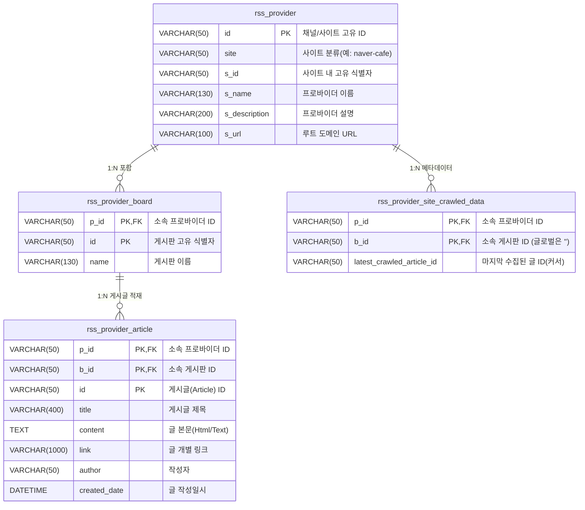

# RSS Feed Server

<p>
  
  
  
  
  
  
  <a href="https://github.com/DarkKaiser/rss-feed-server/blob/main/LICENSE">
    
  </a>
</p>

다양한 목적의 웹 게시판(네이버 카페, 여수시청, 여수 쌍봉초등학교 등)의 새로운 게시글을 자동으로 모니터링 및 크롤링하여 **RSS 2.0 피드**로 일원화해 제공하는 서버 측 애플리케이션 서비스입니다. Docker 환경에서의 배포를 기본적으로 지원하며, 자체 내장 DB(SQLite)와 백그라운드 스케줄러를 기반으로 고성능 피드 서빙을 목표로 합니다.

## 📌 주요 기능

- **다양한 형태의 외부 채널 자동 크롤링**
  - 네이버 카페 (다수 채널 및 게시판 지원 가능)
  - 관공서 사이트 (여수시청 소식 등)
  - 교육기관 게시판 (여수 쌍봉초등학교 소식 등)
- **독립적인 백그라운드 크롤링 엔진 (고효율)**
  - 설정된 `cron` 주기에 기반하여 백그라운드에서 게시글을 자동으로 단일 DB(SQLite)로 적재.
  - 최신 게시글 커서(Cursor) 관리: 불필요한 트래픽 유발 억제
  - 보관 기한 초과 데이터 만료(Purge) 및 오토 마이그레이션(Auto Migrate) 지원.
- **표준화된 RSS 2.0 제공**
  - 클라이언트 요청 시 크롤링을 수행하는 것이 아닌 DB 인덱스 스캔을 통한 "즉각 응답" 시스템.
  - RSS 리더기(구독 애플리케이션) 최적화 호환.
- **텔레그램 등 외부 연동 감시 알림 (`notify-server` 연동)**
  - 크롤링 중 치명적인 에러 발생 시 지정된 Notify 서버를 통해 관리자에게 즉각적인 알림 전송.

## 🗄 데이터베이스 스키마

시스템은 외부 의존성을 낮추기 위해 단일 파일 기반인 `SQLite (WAL mode)`를 사용합니다. 각 프로바이더(게시판 묶음)와 그에 속한 게시글을 관계형 테이블로 관리합니다.



## 🛠 기술 스택

- **Language & Framework**: Go(Golang), Echo(v4)
- **Database**: SQLite3 (`github.com/mattn/go-sqlite3`)
- **Documentation**: Swaggo (`swaggo/swag`, `echo-swagger`)
- **Web Parser**: GoQuery (`PuerkitoBio/goquery`)
- **Scheduler**: cron (`robfig/cron/v3`)
- **Alert/Notification**: `notify-server` (사설 원격 알림 서버)
- **Infrastructure**: Docker, Nginx Proxy Manager, Jenkins

## 🚀 설치 및 실행

### Docker 이미지 빌드

```bash
docker build -t darkkaiser/rss-feed-server .
```

### Docker 컨테이너 실행

```bash
# 기존 컨테이너가 있다면 제거
docker ps -q --filter name=rss-feed-server | grep -q . && docker container stop rss-feed-server && docker container rm rss-feed-server

# 컨테이너 구동
# (Volumes 경로 등은 시스템 구성에 맞게 조정 필요)
docker run -d --name rss-feed-server \
              -e TZ=Asia/Seoul \
              -v /usr/local/docker/rss-feed-server:/usr/local/app \
              -v /usr/local/docker/nginx-proxy-manager/letsencrypt:/etc/letsencrypt:ro \
              -p 3443:3443 \
              --add-host=api.darkkaiser.com:192.168.219.110 \
              --restart="always" \
              darkkaiser/rss-feed-server
```

## 🔒 SSL / TLS 연동

SSL 접속(HTTPS)을 위한 보안 인증서는 Nginx Proxy Manager를 통해 발급된 Let's Encrypt 인증서를 사용하도록 구성되어 있습니다. 인증서 갱신 시 서버에 마운트된 볼륨을 통해 자동으로 최신 인증서 파일을 참조하게 됩니다.
- 인증서 마운트 경로: `/usr/local/docker/nginx-proxy-manager/letsencrypt/live/npm-1`

## 📖 API 엔드포인트 및 문서

API의 자세한 명세와 테스트는 내장된 Swagger 기능(`swag`)을 통해 확인하실 수 있습니다. 시스템이 실행되면 실시간으로 문서에 접근할 수 있습니다.

- **Swagger UI**: `https://rss.darkkaiser.com:3443/swagger/index.html`
- **구독 피드 목록 HTML**: `https://rss.darkkaiser.com:3443/`

### RSS 피드 구독 예시 (`GET /<id>`)
- 애플리케이션 개발 채널 피드: `https://rss.darkkaiser.com:3443/ludypang.xml`
- 여수시 일반 소식: `https://rss.darkkaiser.com:3443/yeosu-cityhall-news.xml`
- 쌍봉초등학교 안내: `https://rss.darkkaiser.com:3443/ssangbong-elementary-school-news.xml`

## 🤝 Contributing

Contributions, issues and feature requests are welcome.<br />
Feel free to check [issues page](https://github.com/DarkKaiser/rss-feed-server/issues) if you want to contribute.

## 👤 Author

**DarkKaiser**
- Blog: [@DarkKaiser](https://www.darkkaiser.com)
- Github: [@DarkKaiser](https://github.com/DarkKaiser)

## 📄 License

This project is licensed under the MIT License - see the [LICENSE](LICENSE) file for details.
